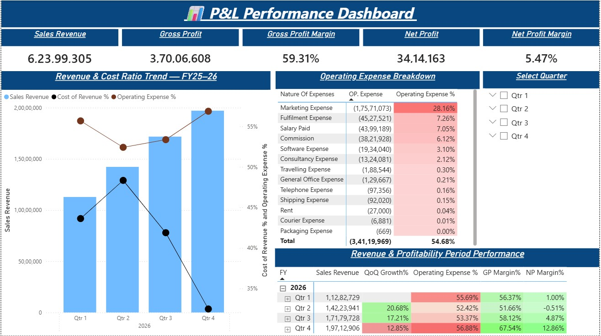

# P&L Performance Dashboard

An interactive Power BI dashboard designed to analyze financial performance across revenue, profitability, operating expenses, and quarterly trends.

## Project Overview

This project presents a P&L Performance Dashboard that provides a clear overview of business performance and profitability. The dashboard helps users analyze key financial metrics, identify major operating expenses, and compare quarterly performance.

## Dashboard Preview

## Key Features

- Sales Revenue, Gross Profit and Net Profit KPIs
- Gross Profit Margin and Net Profit Margin analysis
- Revenue and cost ratio trend analysis
- Operating expense breakdown by category
- Quarterly revenue and profitability performance
- Interactive quarter selection

## Key Metrics

| Metric | Value |
|---|---:|
| Sales Revenue | ₹6.24 Cr |
| Gross Profit | ₹3.70 Cr |
| Gross Profit Margin | 59.31% |
| Net Profit | ₹34.14 L |
| Net Profit Margin | 5.47% |
| Operating Expense % | 54.68% |

## Tools & Skills Used

- Power BI
- DAX
- Power Query
- Data Modeling
- Data Visualization
- KPI Analysis
- Financial Performance Analysis

## Business Insights

- Sales revenue showed consistent growth across the four quarters.
- Gross profit margin remained above 50% throughout the year.
- Marketing was the largest operating expense category.
- Net profitability improved significantly in the fourth quarter.
- The dashboard enables users to identify cost drivers and evaluate quarterly financial performance.

## Dashboard Components

### 1. Financial Performance KPIs
Provides a high-level view of Sales Revenue, Gross Profit, Gross Profit Margin, Net Profit, and Net Profit Margin.

### 2. Revenue & Cost Ratio Trend
Tracks quarterly revenue alongside cost and operating expense ratios.

### 3. Operating Expense Breakdown
Highlights major expense categories and their contribution to total operating expenses.

### 4. Revenue & Profitability Period Performance
Provides a detailed quarterly comparison of revenue growth, operating expenses, and profitability margins.

## Project Purpose

The objective of this project was to create an interactive and easy-to-understand financial dashboard that transforms raw P&L data into meaningful business insights.
